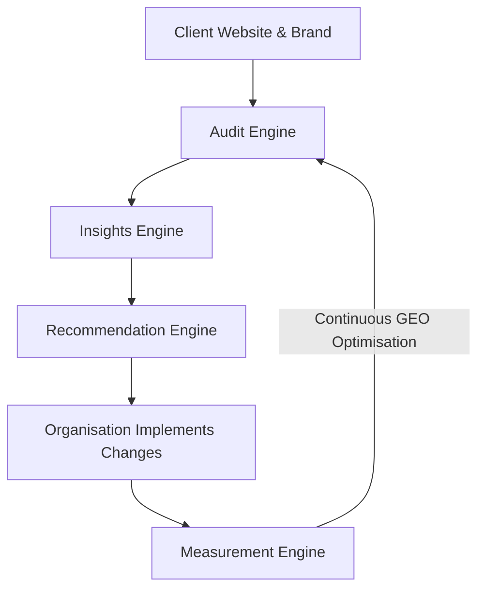
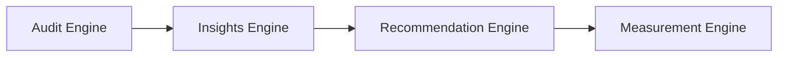
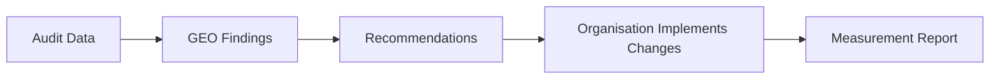

# SignalScope AI

<div align="center">

# 📡 SignalScope AI

### Evidence-Driven Generative Engine Optimisation (GEO) Intelligence Platform

*Measure AI visibility. Generate actionable insights. Prioritise optimisation. Track improvement.*


</div>

---

# Executive Summary

SignalScope AI is an evidence-driven **Generative Engine Optimisation (GEO)** intelligence platform designed to help organisations understand how Large Language Models (LLMs) such as **Google Gemini, ChatGPT and Perplexity** represent their brand during AI-powered search experiences.

Rather than focusing on traditional search engine rankings, SignalScope AI analyses how AI assistants answer real buyer questions, identifies which competitors are mentioned, determines which sources are influencing AI-generated responses, and converts that evidence into structured business insights and prioritised optimisation recommendations.

The platform follows an evidence-first philosophy:

> **Measure → Understand → Recommend → Improve → Measure Again**

Unlike conventional SEO platforms that optimise for search engine result pages (SERPs), SignalScope AI helps organisations optimise their visibility within AI-generated answers, an increasingly important channel as customers rely more heavily on conversational search.

---

# Why SignalScope AI Exists

Artificial Intelligence is fundamentally changing how people discover products, services and businesses.

Instead of searching Google and clicking through multiple websites, users are increasingly asking AI assistants questions such as:

- *Which CRM is best for a growing SaaS company?*
- *What is the best accounting software for small businesses?*
- *Which cybersecurity platform should we consider?*
- *Who are the leading marketing automation providers?*

These systems synthesise information from numerous sources and present a single answer or a shortlist of recommendations.

For organisations, this creates a new challenge.

Many businesses have invested heavily in Search Engine Optimisation (SEO), yet have little visibility into how AI systems describe their brand, which competitors dominate AI responses, or which sources influence those responses.

SignalScope AI was created to provide structured answers to those questions through a transparent, evidence-based workflow.

---

# What SignalScope AI Does

SignalScope AI enables organisations to:

- Audit how AI systems represent their brand.
- Measure brand visibility across AI-generated responses.
- Identify which competitors dominate buyer conversations.
- Discover which sources AI systems trust.
- Detect gaps in content coverage and authority.
- Generate evidence-backed optimisation recommendations.
- Measure improvement between successive GEO audits.

The platform is intentionally designed as an **intelligence and decision-support system** rather than an automated optimisation tool.

Recommendations are generated from observable evidence, while implementation remains under the control of the organisation, ensuring transparency, auditability and trust.

---

# Table of Contents

- [The GEO Workflow](#the-geo-workflow)
- [System Architecture](#system-architecture)
- [Core Product Components](#core-product-components)
- [Technology Stack](#technology-stack)
- [Repository Structure](#repository-structure)
- [Getting Started](#getting-started)
- [Running SignalScope AI](#running-signalscope-ai)
- [Testing](#testing)
- [Example Outputs](#example-outputs)
- [Design Principles](#design-principles)
- [Current Limitations](#current-limitations)
- [Roadmap](#roadmap)
- [Author](#author)

---

# The GEO Workflow

SignalScope AI follows a simple but evidence-driven workflow that mirrors how a GEO consultant would approach an optimisation engagement.

Rather than attempting to automatically "improve" AI visibility, the platform first measures how AI systems currently represent a brand, explains why that representation exists, recommends evidence-backed improvements, and finally measures whether those improvements have had an effect after implementation.

This creates a repeatable optimisation cycle.



The workflow deliberately separates **analysis** from **implementation**.

SignalScope AI provides intelligence and decision support, while implementation remains under the control of the organisation.

This design improves transparency, prevents unsupported automation, and allows every recommendation to be traced back to observable evidence.

---

# System Architecture

The platform is organised into four independent engines.

Each engine has a clearly defined responsibility, allowing the system to remain modular, testable and maintainable.



Each engine produces structured outputs that become the inputs for the next stage of the workflow.

This architecture avoids tightly coupled components and makes future extensions easier without affecting existing functionality.

---

# Core Product Components

## Audit Engine

The Audit Engine collects structured evidence by asking AI systems predefined buyer questions.

Its responsibilities include:

- Executing GEO audits.
- Recording AI-generated responses.
- Extracting structured evidence.
- Standardising audit outputs.
- Preparing datasets for downstream analysis.

The Audit Engine intentionally performs **measurement only**.

It does not attempt to interpret findings or produce recommendations.

---

## Insights Engine

The Insights Engine transforms raw audit evidence into deterministic business findings.

Rather than relying on another AI model to interpret every result, the engine calculates measurable observations wherever possible.

Examples include:

- Brand visibility
- Competitor frequency
- Authority source analysis
- Sentiment distribution
- Content coverage
- GEO maturity

The output of this stage becomes a structured collection of findings used throughout the rest of the platform.

---

## Recommendation Engine

The Recommendation Engine converts validated findings into prioritised optimisation opportunities.

Every recommendation is explicitly linked back to supporting evidence.

Each recommendation contains:

- Recommendation title
- Business rationale
- Supporting evidence
- Recommended action
- Potential impact
- Indicative effort
- Confidence
- Priority
- Success metric

This ensures recommendations remain transparent, explainable and evidence-backed.

---

## Measurement Engine

The Measurement Engine compares two completed GEO audits.

Its purpose is to determine whether optimisation efforts have produced measurable improvements.

Metrics include:

- Brand visibility
- Competitor mentions
- Authority sources
- Sentiment
- GEO maturity
- Content coverage

When historical data is unavailable, the engine performs a clearly labelled structural validation instead of generating misleading improvement claims.

---

# Technology Stack

SignalScope AI has been intentionally designed around a lightweight, modular Python architecture with a strong emphasis on transparency, deterministic processing and maintainability.

Rather than relying on a complex framework, the project favours clear separation of responsibilities between components, allowing each engine to be independently developed, tested and extended.

| Category | Technology | Purpose |
|-----------|------------|---------|
| Language | Python 3.11+ | Core application |
| AI Model | Google Gemini | Structured reasoning and recommendation generation |
| Testing | unittest | Automated testing |
| Data Format | JSON | Structured audit and analysis data |
| Reports | Markdown | Human-readable outputs |
| Version Control | Git & GitHub | Source control |
| Development | VS Code | Development environment |

---

# Technical Architecture

The platform follows a modular pipeline architecture.

Each engine performs one clearly defined responsibility before passing structured outputs to the next stage.

```text
Audit Data
      │
      ▼
Insights Engine
      │
      ▼
Recommendation Engine
      │
      ▼
Measurement Engine
```

Each module is designed to be:

- Independent
- Testable
- Deterministic where appropriate
- Easy to replace or extend
- Loosely coupled

This architecture allows future functionality to be introduced without requiring major changes to existing components.

---

# Repository Structure

```text
SignalScope-AI/
│
├── audits/
│
├── docs/
│
├── reports/
│   ├── audit_results/
│   ├── findings/
│   ├── recommendations/
│   └── progress/
│
├── src/
│
├── tests/
│
├── requirements.txt
│
├── README.md
│
└── .gitignore
```

The repository has been organised to clearly separate application logic, generated outputs and automated tests.

---

# Repository Breakdown

## `/src`

Contains the core application code.

Each major component of SignalScope AI is implemented as an independent module.

Examples include:

- Audit processing
- Findings analysis
- Recommendation generation
- Measurement engine
- Shared utility functions

The source code intentionally follows a modular structure to minimise dependencies between components.

---

## `/tests`

Contains the automated unit test suite.

The project follows a testing-first mindset, with each engine accompanied by dedicated test cases covering expected behaviour, validation rules and edge cases.

By Version 2.0.0 the project contains **270+ automated tests**, providing confidence that new changes do not unintentionally break existing functionality.

---

## `/reports`

Stores all human-readable outputs generated by the application.

Typical reports include:

- GEO Findings
- GEO Recommendations
- GEO Progress Reports

Markdown was selected because it is lightweight, portable and renders cleanly on GitHub.

---

## `/audits`

Stores structured audit datasets captured during GEO analysis.

These datasets form the evidence base used throughout the rest of the workflow.

Rather than generating recommendations directly from AI conversations, SignalScope AI first standardises audit evidence before performing analysis.

This improves reproducibility and transparency.

---

## `/docs`

Contains supporting documentation, design notes and future technical documentation.

Keeping supporting material separate from application code helps maintain a clean repository structure.

---

# Engineering Philosophy

SignalScope AI was developed around several engineering principles.

### Evidence before interpretation

Recommendations should always be traceable back to observable evidence.

---

### Deterministic where possible

Calculations such as visibility scoring, frequency counts and maturity assessments should be deterministic rather than generated by an LLM.

---

### AI where judgement adds value

Large Language Models are used where interpretation, summarisation or reasoning provides genuine value, rather than replacing deterministic calculations.

---

### Separation of concerns

Each engine performs one primary responsibility.

This makes the system easier to understand, test and extend.

---

### Explainability

Every recommendation produced by the platform can be linked back to supporting findings and audit evidence.

This improves trust in the generated outputs and reduces the risk of unsupported recommendations.

---

# Engine Deep Dive

SignalScope AI is built around four independent processing engines.

Each engine performs a single responsibility within the overall GEO workflow and passes structured outputs to the next stage.

This modular architecture improves maintainability, simplifies testing and allows future enhancements without affecting the rest of the platform.

---

# Audit Engine

## Purpose

The Audit Engine is responsible for collecting structured evidence from AI-powered search systems.

It represents the starting point of every GEO assessment.

Rather than attempting to analyse or optimise anything, the Audit Engine focuses exclusively on collecting accurate, repeatable evidence.

---

## Responsibilities

- Execute predefined buyer-question prompts.
- Capture AI-generated responses.
- Identify brand mentions.
- Identify competitor mentions.
- Extract referenced sources.
- Record sentiment indicators.
- Store structured audit data.

---

## Inputs

The Audit Engine accepts:

- Target company or brand
- Website URL
- Buyer question set
- Audit configuration

---

## Outputs

The engine produces structured audit datasets containing:

- AI response text
- Brand visibility
- Competitor visibility
- Referenced websites
- Supporting metadata

These outputs become the evidence base used throughout the remainder of the platform.

---

## Design Decision

The Audit Engine intentionally performs **measurement only**.

No interpretation or recommendations occur at this stage.

Separating data collection from interpretation ensures that downstream analysis always works from observable evidence rather than assumptions.

---

# Insights Engine

## Purpose

The Insights Engine transforms raw audit evidence into meaningful business findings.

Its role is to answer questions such as:

- How visible is the brand?
- Which competitors dominate?
- Which sources influence AI responses?
- What themes appear consistently?
- How mature is the organisation's GEO presence?

---

## Responsibilities

- Aggregate audit results.
- Calculate deterministic metrics.
- Identify recurring patterns.
- Produce structured findings.
- Estimate GEO maturity.

---

## Inputs

- Completed audit dataset

---

## Outputs

The engine produces a collection of structured findings.

Each finding contains:

- Title
- Value
- Supporting evidence
- Confidence

These findings are intentionally factual.

They explain what the platform observed rather than recommending what should happen next.

---

## Design Decision

Wherever possible, findings are calculated using deterministic Python logic rather than another AI model.

This improves consistency, reproducibility and trust.

Large Language Models are reserved for tasks that genuinely require interpretation.

---

# Recommendation Engine

## Purpose

The Recommendation Engine converts validated findings into prioritised optimisation opportunities.

Rather than generating generic marketing advice, recommendations are grounded in observable evidence collected during the audit.

---

## Responsibilities

- Analyse structured findings.
- Generate optimisation opportunities.
- Explain why each recommendation exists.
- Prioritise recommendations.
- Estimate business impact.
- Estimate implementation effort.

---

## Inputs

- Structured findings generated by the Insights Engine.

---

## Outputs

Each recommendation contains:

- Recommendation title
- Problem addressed
- Recommendation rationale
- Recommended action
- Supporting evidence
- Potential impact
- Indicative effort
- Confidence
- Priority
- Success metric

---

## Design Decision

Recommendations never exist in isolation.

Every recommendation must be traceable back to one or more findings generated during the previous stage.

This evidence-first philosophy improves transparency and allows users to understand exactly why a recommendation was produced.

---

# Measurement Engine

## Purpose

The Measurement Engine determines whether optimisation activities have produced measurable improvements over time.

Rather than claiming success automatically, the engine compares two completed GEO audits.

---

## Responsibilities

- Compare audit datasets.
- Measure change.
- Highlight improvement.
- Detect regression.
- Produce comparison reports.

---

## Inputs

- Baseline audit
- Follow-up audit

---

## Outputs

Comparison metrics include:

- Brand visibility
- Competitor mentions
- Authority sources
- Sentiment
- GEO maturity
- Content coverage

The resulting report provides an evidence-based assessment of change between audit cycles.

---

## Structural Validation

When only a single audit is available, the engine performs a structural validation instead of calculating improvements.

This prevents misleading conclusions while still validating that the comparison pipeline functions correctly.

---

# End-to-End Data Flow

The four engines operate sequentially.

```mermaid
flowchart LR

A[Website & Brand]

A --> B[Audit Engine]

B --> C[Structured Audit Data]

C --> D[Insights Engine]

D --> E[Structured Findings]

E --> F[Recommendation Engine]

F --> G[Prioritised Recommendations]

G --> H[Organisation Implements Changes]

H --> I[Follow-up Audit]

I --> J[Measurement Engine]

J --> K[Progress Report]
```



Each stage produces structured outputs that become the inputs for the next engine.

This pipeline architecture creates clear boundaries between responsibilities while making the system easier to maintain, extend and test.

---

# Why This Architecture?

Several architectural approaches were considered during development.

The final design was chosen because it provides:

- Clear separation of concerns.
- Strong evidence traceability.
- High testability.
- Modular components.
- Reduced coupling between engines.
- Easier future expansion.

Most importantly, it ensures that recommendations are never disconnected from the evidence that generated them.

This principle underpins the entire philosophy of SignalScope AI.

# Getting Started

This section explains how to install, configure and run SignalScope AI locally.

The project has been designed to be lightweight, requiring only Python and a small number of dependencies.

---

# Prerequisites

Before running SignalScope AI, ensure the following software is installed:

| Requirement | Version |
|------------|---------|
| Python | 3.11 or later |
| Git | Latest |
| Google Gemini API Key | Required |
| pip | Latest |

It is recommended to use a virtual environment to isolate project dependencies.

---

# Clone the Repository

```bash
git clone https://github.com/YOUR_USERNAME/SignalScope-AI.git

cd SignalScope-AI
```

---

# Create a Virtual Environment

### Windows

```bash
python -m venv .venv

.venv\Scripts\activate
```

### macOS / Linux

```bash
python3 -m venv .venv

source .venv/bin/activate
```

---

# Install Dependencies

```bash
pip install -r requirements.txt
```

---

# Configure Environment Variables

Create a `.env` file in the project root.

Example:

```text
GEMINI_API_KEY=your_api_key_here
```

> **Important:** Never commit API keys or other secrets to GitHub. The `.env` file should remain excluded via `.gitignore`.

---

# Running SignalScope AI

The project can be executed as a complete end-to-end workflow or by running each engine independently.

---

## Option 1 – Run the Complete Workflow

```bash
python src/run_end_to_end_demo.py
```

This executes the complete GEO pipeline:

1. Load audit data.
2. Generate findings.
3. Generate recommendations.
4. Produce measurement reports.
5. Export Markdown reports.

---

## Option 2 – Run Individual Engines

### Audit Engine

```bash
python src/audit_engine.py
```

---

### Insights Engine

```bash
python src/geo_findings_analyzer.py
```

---

### Recommendation Engine

```bash
python src/recommendation_engine.py
```

---

### Measurement Engine

```bash
python src/measurement_engine.py
```

Running engines independently is useful during development, debugging and future feature expansion.

---

# Running the Test Suite

SignalScope AI includes a comprehensive automated test suite.

Run every test with:

```bash
python -m unittest discover -s tests -v
```

A successful execution should complete without failures.

Example output:

```text
----------------------------------------------------------------------
Ran 270+ tests

OK
```

The extensive test suite helps ensure that new features do not unintentionally break existing functionality.

---

# Generated Outputs

Running the complete workflow produces several Markdown reports.

Typical outputs include:

| Report | Purpose |
|---------|---------|
| GEO Findings | Deterministic business findings derived from audit evidence |
| GEO Recommendations | Prioritised optimisation recommendations |
| GEO Progress | Measurement report comparing audit runs |

These reports are designed to be easily shared with stakeholders or incorporated into broader GEO consulting engagements.

---

# Troubleshooting

## Missing API Key

If the application reports authentication errors, verify that the `GEMINI_API_KEY` environment variable has been correctly configured.

---

## Dependency Issues

Ensure all required packages have been installed by running:

```bash
pip install -r requirements.txt
```

---

## Python Version

SignalScope AI has been developed using **Python 3.11+**.

Older versions of Python may not support all language features used within the project.

---

## Test Failures

If automated tests fail after making code changes:

1. Review the failing test output.
2. Verify recent modifications.
3. Re-run the affected module.
4. Ensure no generated report files have been manually edited.

---

# Development Workflow

The recommended development workflow is:

```text
Modify Code
      │
      ▼
Run Tests
      │
      ▼
Generate Reports
      │
      ▼
Review Outputs
      │
      ▼
Commit Changes
```

This workflow encourages small, testable iterations while maintaining confidence in the integrity of the system.

---

# Example Outputs

SignalScope AI produces a series of structured Markdown reports that guide organisations through the complete GEO optimisation lifecycle.

Each report has a distinct purpose within the overall workflow.

---

# 1. GEO Findings Report

The Findings Report summarises the measurable observations extracted from the audit dataset.

Rather than offering recommendations, this report focuses exclusively on presenting evidence.

Typical findings include:

- Brand visibility
- Competitor visibility
- Authority sources
- Sentiment distribution
- Content coverage
- GEO maturity

Example:

```text
Brand Visibility
──────────────────────────
Visible in 68% of buyer questions.

Confidence:
High

Evidence:
Brand mentioned in 17 of 25 responses.
```

---

# 2. GEO Recommendations Report

Recommendations are generated from validated findings.

Every recommendation is linked directly to the evidence that produced it.

Example:

```text
Recommendation

Improve comparison content for CRM implementation services.

Why?

Competitors were consistently referenced for implementation guidance while the audited brand was rarely cited.

Potential Impact

High

Indicative Effort

Medium

Supporting Evidence

Competitor mentioned in 14 buyer questions.
Brand mentioned in only 4.
```

This evidence-first approach prevents recommendations from becoming generic marketing advice.

---

# 3. GEO Progress Report

The Progress Report compares two completed GEO audits.

Its purpose is to determine whether optimisation activities have produced measurable improvements.

Typical comparison metrics include:

- Brand visibility
- Competitor mentions
- Authority sources
- Sentiment
- Content coverage
- GEO maturity

Example:

```text
Brand Visibility

Baseline:
64%

Current:
79%

Change:
+15%

Direction:
Improved
```

When historical audit data is unavailable, SignalScope AI performs a structural validation instead of generating misleading improvement claims.

---

# Report Pipeline



---

# Screenshots

The following screenshots illustrate the outputs produced by SignalScope AI.

> **Note:** Replace these placeholders with screenshots from your repository once available.

## GEO Findings

```
docs/screenshots/findings-report.png
```

---

## GEO Recommendations

```
docs/screenshots/recommendations-report.png
```

---

## GEO Progress

```
docs/screenshots/progress-report.png
```

---

## Test Suite

```
docs/screenshots/test-suite.png
```

---

## End-to-End Demo

```
docs/screenshots/demo.png
```

---

# Output Philosophy

SignalScope AI deliberately produces **human-readable Markdown reports** instead of proprietary binary formats.

This provides several advantages:

- Easy to version control
- Easy to review in GitHub
- Easy to share with stakeholders
- Portable across platforms
- Simple to convert into PDFs or presentations
- Transparent and auditable

The reports are intended to support consultants, marketers, RevOps teams and business leaders by turning AI search evidence into actionable business intelligence.

---

# Design Decisions

SignalScope AI was not designed simply to generate AI-powered recommendations. Instead, the project was built around a series of deliberate architectural decisions intended to maximise transparency, maintainability and trust.

This section explains the reasoning behind those decisions.

---

## Evidence Before Intelligence

One of the earliest design decisions was that recommendations should never be produced directly from raw AI conversations.

Instead, the platform follows a staged process:

```text
Evidence
    ↓
Insights
    ↓
Recommendations
    ↓
Measurement
```

This ensures every recommendation can be traced back to observable evidence.

The result is a system that is significantly easier to validate, debug and explain.

---

## Why Four Independent Engines?

Rather than building one large application that performs every task, SignalScope AI separates responsibilities into four specialised engines.

Each engine has a single responsibility:

| Engine | Responsibility |
|---------|----------------|
| Audit | Collect evidence |
| Insights | Explain the evidence |
| Recommendations | Prioritise actions |
| Measurement | Measure change |

This separation provides several advantages:

- Easier testing
- Better maintainability
- Clearer architecture
- Simpler future expansion
- Reduced coupling

---

## Deterministic Logic vs AI Reasoning

Large Language Models are exceptionally good at reasoning over complex information.

However, they are not ideal for deterministic calculations.

For this reason, SignalScope AI intentionally divides responsibilities.

Python performs tasks such as:

- counting
- aggregation
- scoring
- frequency analysis
- comparisons
- maturity calculations

The AI model performs tasks such as:

- summarisation
- interpretation
- recommendation generation
- explanation

This hybrid architecture combines the reliability of deterministic software with the flexibility of modern AI systems.

---

## Recommendations Must Be Explainable

One of the primary goals of the project is explainability.

Every recommendation must answer three questions:

1. Why was this generated?
2. What evidence supports it?
3. How could success be measured?

Recommendations without supporting evidence are intentionally rejected.

This design improves user trust and encourages evidence-based decision making.

---

## Modular by Design

Every engine communicates using structured outputs rather than tightly coupled internal logic.

This makes future enhancements straightforward.

For example, future versions could replace the Recommendation Engine with another model without requiring changes to the Audit or Insights engines.

---

## Measurement Over Assumption

Many AI applications claim improvement without demonstrating measurable change.

SignalScope AI deliberately avoids this.

Improvement is only reported when two comparable audit datasets exist.

If historical data is unavailable, the platform performs a structural validation rather than generating misleading claims.

This reflects the broader philosophy of the project:

> **Evidence should always take precedence over assumption.**

---

# AI Trust Boundaries

SignalScope AI intentionally limits where AI is allowed to make decisions.

| Activity | Python | AI |
|----------|:------:|:--:|
| Count mentions | ✅ | |
| Compare datasets | ✅ | |
| Calculate maturity | ✅ | |
| Summarise findings | | ✅ |
| Generate recommendations | | ✅ |
| Explain business implications | | ✅ |

This separation increases reliability while reducing the likelihood of inconsistent outputs.

---

# Key Principles

The development of SignalScope AI was guided by five principles.

### Transparency

Every recommendation should be explainable.

---

### Evidence

Evidence should always come before interpretation.

---

### Simplicity

Each engine should perform one responsibility well.

---

### Maintainability

Modules should be replaceable without affecting the remainder of the platform.

---

### Trust

Users should understand not only **what** the platform recommends but **why** it recommends it.

These principles influenced every architectural decision throughout the development of Version 2.0.0.

---

# Current Limitations

SignalScope AI Version 2.0.0 represents a complete end-to-end GEO intelligence workflow. However, like any software project, it has defined boundaries and opportunities for future development.

The current version intentionally focuses on providing accurate, transparent and evidence-driven GEO analysis rather than attempting to solve every possible optimisation challenge.

The following limitations are known and have been accepted as design decisions for Version 2.0.0.

---

## Single AI Provider

The current implementation has been developed around **Google Gemini**.

Although the overall architecture is provider-agnostic, support for additional Large Language Models has not yet been implemented.

Potential future integrations include:

- OpenAI ChatGPT
- Anthropic Claude
- Perplexity AI
- Microsoft Copilot
- Meta AI

Supporting multiple providers would enable richer comparisons across different AI ecosystems.

---

## Single Audit Demonstration

The repository currently contains a demonstration audit used to validate the complete processing pipeline.

While the Measurement Engine fully supports before-and-after comparisons, a genuine longitudinal dataset is required to demonstrate real optimisation improvements over time.

The current structural validation confirms that the comparison workflow functions correctly without generating misleading claims.

---

## Manual Implementation

SignalScope AI deliberately stops after producing recommendations.

The platform identifies optimisation opportunities but does not automatically modify websites, content or third-party platforms.

This is an intentional product decision.

Human review remains essential before implementing strategic changes.

---

## Limited Visualisation

Version 2.0.0 produces structured Markdown reports designed for transparency and portability.

Future versions could include interactive dashboards for richer exploration of audit results and historical trends.

---

## Enterprise Features

Several enterprise capabilities remain outside the scope of the current implementation, including:

- User authentication
- Multi-tenant workspaces
- Organisation management
- Role-based permissions
- Scheduled audit execution
- Cloud deployment
- API access
- Usage analytics

These features would become increasingly important as the platform evolves into a production-ready SaaS application.

---

# Roadmap

The roadmap reflects logical product evolution rather than an exhaustive feature list.

Each future enhancement has been considered within the context of maintaining the platform's evidence-first philosophy.

---

## Version 2.1

Focus on improving usability.

Potential enhancements include:

- Enhanced report formatting
- Improved configuration options
- Additional GEO metrics
- Expanded documentation
- Better error handling

---

## Version 3.0

Expand analytical capabilities.

Possible additions include:

- Multi-provider AI analysis
- Cross-provider comparison reports
- Historical trend analysis
- Competitor benchmarking
- Enhanced authority source analysis
- Interactive dashboards

---

## Version 4.0

Introduce enterprise-ready functionality.

Potential capabilities include:

- Team collaboration
- User accounts
- Cloud deployment
- Scheduled recurring audits
- REST API
- Web interface
- Organisation-level reporting

---

# Long-Term Vision

The long-term ambition for SignalScope AI is to become an evidence-driven GEO intelligence platform that helps organisations understand and improve how they are represented within AI-generated search experiences.

Rather than replacing consultants or marketing teams, the platform is intended to augment strategic decision-making through transparent analysis, explainable recommendations and measurable outcomes.

Its guiding principle will remain unchanged:

> **Measure first. Understand second. Optimise third. Measure again.**

---

# Project Status

| Category | Status |
|----------|--------|
| Version | ✅ v2.0.0 |
| Audit Engine | ✅ Complete |
| Insights Engine | ✅ Complete |
| Recommendation Engine | ✅ Complete |
| Measurement Engine | ✅ Complete |
| Automated Testing | ✅ 270+ Tests |
| Documentation | 🚧 In Progress |
| Future Enhancements | 📋 Planned |

The completion of Version 2.0.0 marks the end of the core engineering phase and establishes a stable foundation for future enhancements.

---


